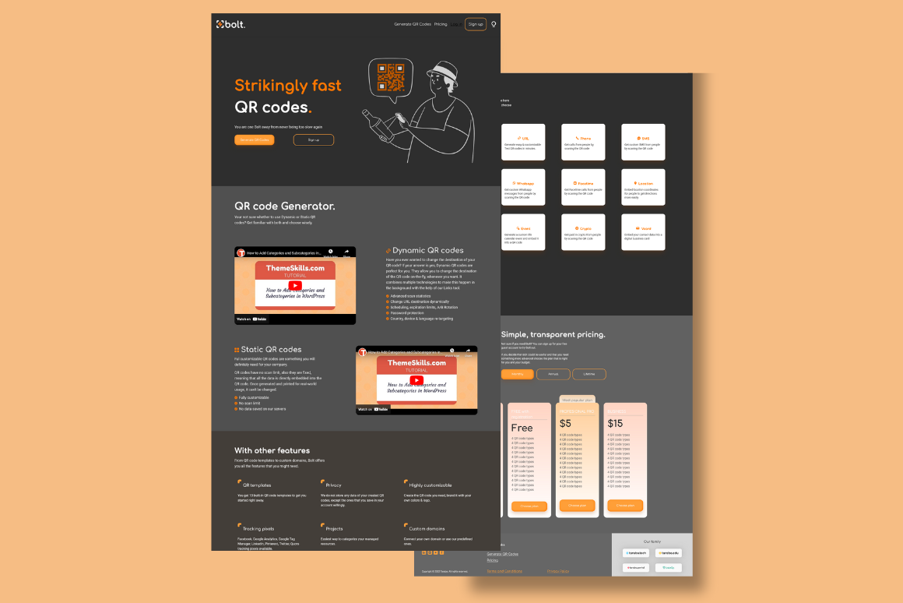

# Zadatak za Taraba Tech - Tailwind CSS - Frontend Developer (CSS) - Intern position - Jelena Jovičić

### Linkovi

- [Repo](https://github.com/je-jo/taraba-test-tailwind-je-jo)
- [Live](https://taraba-test-tailwind-je-jo.netlify.app/)

### Korišćeno

- Semantic HTML5 markup
- Mobile-first workflow
- Tailwind CSS
- JavaScript

### Screenshot

  

### Korisni linkovi

- [google web fonts helper](https://gwfh.mranftl.com/fonts) - A Hassle-Free Way to Self-Host Google Fonts.

### Autor

- [Github](https://github.com/je-jo)
- [LinkedIn](https://www.linkedin.com/in/jelena-jovicic/)
- jejovicic@gmail.com

